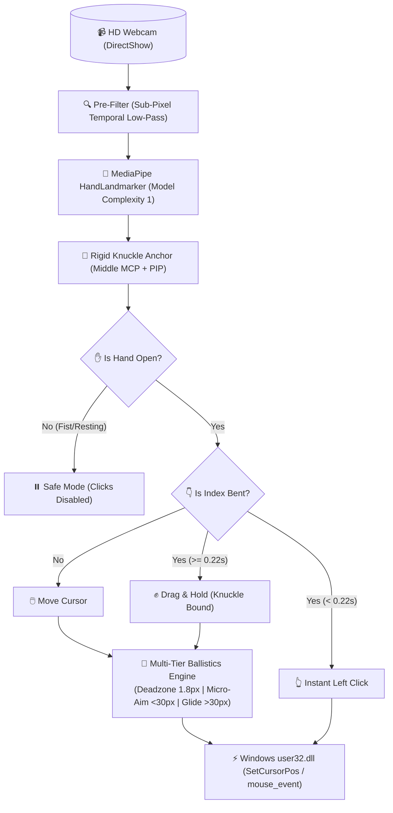

# 🖱️ AI Virtual Mouse

<p align="center">
  
  
  
  
  
</p>

<p align="center">
  <b>A lightweight, ultra-high precision AI virtual mouse for Windows with decoupled ergonomic gestures, zero click drift, and sub-pixel multi-tier ballistics.</b>
</p>

---

## ⚡ Why AI Virtual Mouse?

Most open-source virtual mice suffer from critical usability flaws:
- **Severe cursor jitter** when trying to click small buttons.
- **Downward cursor drop** when curling fingers to click.
- **Sluggish cursor latency** caused by heavy artificial delays in libraries like PyAutoGUI.
- **100% CPU lock & privacy issues** because the webcam runs continuously.

**AI Virtual Mouse** is engineered from the ground up to solve every single one of these problems:

| Feature | Standard GitHub Virtual Mice | **AI Virtual Mouse (This Repo)** |
| :--- | :---: | :---: |
| **Cursor Control Engine** | `pyautogui` (Laggy, 10ms artificial delay) | **Native Win32 C API** (Near 0.001ms hardware latency) |
| **Click Drift / Drop** | ❌ Drops 50–100px when curling finger | **✅ 0.0px Drift** (Pre-click freeze & decoupled tracking) |
| **Jitter vs Latency** | ❌ Shaky OR slow moving average | **✅ Multi-tier Precision Ballistics** (1.8px deadzone) |
| **Safety Guard** | ❌ Accidental clicks when moving/resting | **✅ Open-Hand Verification** (Fist/rest = Clicks disabled) |
| **Webcam Standby** | ❌ Camera locked forever, 25% CPU | **✅ 0.0% CPU Standby** (Camera freed when inactive) |
| **Windows Taskbar Reach** | ❌ Hand falls off camera boundary | **✅ Ergonomic Margin Buffer** (Full reach without hand contortion) |

---

## 🧠 System Architecture



---

## ✋ Ergonomic Hand Gestures

> [!TIP]
> The cursor is guided by your **Middle Finger & Palm Base**. The **Index Finger** functions purely as the physical mouse button!

| Gesture | Action | Description |
| :--- | :--- | :--- |
| **Middle Finger / Hand** | **Move Cursor** | Smooth, liquid glide across your entire monitor |
| **Open Hand + Tap Index Finger** | **Left Click** | Quick downward tap & release (like a physical mouse button) |
| **Open Hand + Double Tap Index** | **Double Click** | Two quick consecutive taps |
| **Open Hand + Hold Index Bent** | **Drag & Hold** | Hold index bent (>0.2s) to drag windows/files; straighten to release |
| **Open Hand + Thumb-Middle Pinch**| **Right Click** | Tap thumb tip to middle finger tip for context menu |
| **Middle + Ring Fingers Together**| **Scroll** | Move hand up to scroll up, move down to scroll down |
| **Hand Closed / Fist** | **Resting** | Clicks are strictly disabled while hand is relaxed or closed |

---

## ⌨️ Global Shortcuts

| Hotkey | Action |
| :--- | :--- |
| `Ctrl + Alt + M` or `F8` | **Toggle Tracking ON / OFF** (Instant standby) |
| `Ctrl + Alt + Q` | **Exit Application** |
| `H` *(inside preview)* | **Hide/Show Camera HUD** (Runs headless in background) |
| `S` *(inside preview)* | **Toggle Audio Feedback** (Soft chimes for clicks & status) |

---

## 🚀 Quick Start

### 1. Prerequisites
Ensure Python 3.10+ is installed on Windows.

### 2. Clone & Install
```bash
git clone https://github.com/RMNO21/ai-virtual-mouse.git
cd ai-virtual-mouse
pip install -r requirements.txt
```

### 3. Run
Double-click **`run.bat`** or execute:
```bash
python virtual_mouse.py
```

Press **`F8`** or **`Ctrl + Alt + M`** to activate tracking!

---

## ⚙️ Configuration (`config.json`)

Fine-tune every aspect of the engine to match your preferences:

```json
{
  "start_active": false,
  "hotkeys": {
    "toggle": "ctrl+alt+m",
    "toggle_alternative": "f8",
    "exit": "ctrl+alt+q"
  },
  "camera": {
    "device_id": 0,
    "width": 640,
    "height": 480,
    "fps": 60
  },
  "interaction": {
    "margin_left": 0.15,
    "margin_right": 0.15,
    "margin_top": 0.15,
    "margin_bottom": 0.20,
    "speed_multiplier": 1.15,
    "pinch_threshold": 0.38,
    "release_threshold": 0.52,
    "drag_hold_delay": 0.22,
    "scroll_sensitivity": 30.0
  },
  "filter": {
    "deadzone": 1.8,
    "min_alpha": 0.09,
    "max_alpha": 0.88,
    "precision_range": 30.0,
    "speed_range": 140.0
  },
  "ui": {
    "sound_effects": true,
    "show_preview": true,
    "preview_width": 380,
    "preview_height": 285
  }
}
```

---

## 🛠️ Technology Stack

- **[MediaPipe](https://developers.google.com/mediapipe)**: 3D Hand Landmark regression model (Complexity 1)
- **[OpenCV](https://opencv.org/)**: Camera frame acquisition with Windows DirectShow (`CAP_DSHOW`)
- **[Win32 API](https://learn.microsoft.com/en-us/windows/win32/)**: Direct low-level C mouse control via `ctypes.windll.user32`
- **[Keyboard](https://github.com/boppreh/keyboard)**: System-wide low-latency global hotkey hooking

---

## 🤝 Contributing

Contributions, issues, and feature requests are welcome!
Feel free to check the [issues page](https://github.com/RMNO21/ai-virtual-mouse/issues).

---

## 📄 License

Distributed under the **MIT License**. See [`LICENSE`](LICENSE) for more information.

<p align="center">
  Made with ❤️ by <a href="https://github.com/RMNO21">RMNO21</a>
</p>
